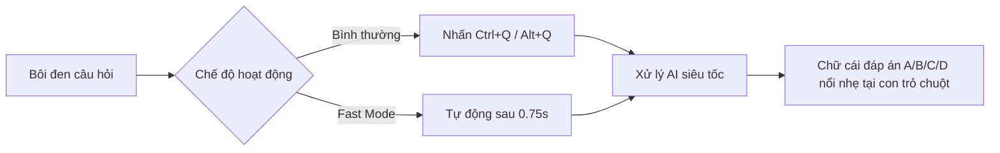

<div align="center">

# 👻 ViTai v2.0 — Ghost AI Assistant

### *Siêu trợ lý AI bôi đen cực nhanh — Ẩn mình tuyệt đối — Tối ưu cho Fedora (Wayland) & Windows*

[](https://www.python.org/)
[](https://www.qt.io/)
[-51A2DA?style=for-the-badge&logo=fedora&logoColor=white)](https://getfedora.org/)
[](https://www.microsoft.com/)
[](LICENSE)

<br/>

[English](README.md) • [Tiếng Việt](#-tính-năng-nổi-bật) • [Tải về](#-tải-về--cài-đặt-nhanh) • [Cấu hình AI](#-cấu-hình-ai-providers) • [Tự Build](#-build-từ-mã-nguồn)

---

</div>

## 🌟 Giới thiệu

**ViTai** là ứng dụng trợ lý AI ẩn mình (**Ghost Assistant**) siêu nhẹ, được thiết kế để giải nhanh câu hỏi trắc nghiệm, phân tích tài liệu và hỗ trợ học tập ngay khi bạn bôi đen văn bản.

Khác với các ứng dụng thông thường có cửa sổ cồng kềnh, **ViTai v2.0** hoạt động ở chế độ **Ghost Mode** — hiển thị duy nhất **một ký tự đáp án** (ví dụ: `A`, `B`, `C`, `D`...) với độ mờ và màu sắc thanh thoát ngay tại vị trí con trỏ chuột, rồi tự biến mất mà không để lại bất kỳ dấu vết nào trên màn hình.

---

## 🔥 Tính năng nổi bật

| Tính năng | Mô tả |
|---|---|
| 👻 **Pure Ghost Overlay** | Giao diện 100% trong suốt, không viền, không khung hộp đen. Chỉ hiện ký tự đáp án thanh mảnh, tự ẩn sau 5 giây hoặc khi click chuột. |
| ⚡ **Fast Mode (Zero-Hotkey)** | Tự động quét vùng chọn bôi đen. Chỉ cần kéo thả chuột là AI tự giải và hiện đáp án ngay lập tức mà không cần chạm bàn phím. |
| 🐧 **Chuẩn hóa Fedora 44 (Wayland)** | Hỗ trợ sâu GNOME Global Shortcuts qua `gsettings`, giao tiếp Unix Socket (`vitai.sock`) và đọc bộ nhớ đệm `PRIMARY` trực tiếp. |
| 🪟 **Native Windows Support** | Sử dụng Win32 API Hook (`RegisterHotKey`) và mô phỏng bàn phím phần cứng `SendInput` đạt độ trễ cực thấp. |
| 🖱️ **Kernel Mouse Tracker** | Bộ theo dõi tọa độ con trỏ chuột cấp Linux Kernel (`evdev`), gắn đáp án bám sát điểm kết thúc bôi đen. |
| 📜 **Live System Logs** | Tab **Log** thời gian thực trong phần Cài đặt giúp theo dõi toàn bộ chu trình: văn bản bắt được, request gửi đi, token và kết quả từ AI. |
| 💾 **Smart Answer Cache** | Bộ nhớ tạm lưu kết quả câu hỏi giúp phản hồi tức thì (**0ms**) khi gặp lại câu hỏi cũ. |
| 🤖 **Đa dạng AI Providers** | Tương thích linh hoạt với **9router**, **Anthropic Claude**, **OpenAI GPT-4o**, **Google Gemini**, **DeepSeek**,... |

---

## 📥 Tải về & Cài đặt nhanh

### Cách 1: Tải bản đóng gói sẵn (Releases)

Truy cập trang [Releases](https://github.com/namtacozz/ViTai/releases) và tải bản phù hợp với hệ điều hành của bạn:

* 🪟 **Windows**: Tải `ViTai-Windows-x64.zip` → Giải nén → Mở file `ViTai.exe`.
* 🐧 **Fedora / Linux**: Tải `ViTai-Linux-x86_64.tar.gz` → Giải nén → Chạy file binary `./ViTai`.

> 💡 **Khuyến nghị cho người dùng Fedora 44 / Wayland**:
> Để bật tính năng theo dõi vị trí chuột chính xác 100%, hãy thêm người dùng vào nhóm `input`:
> ```bash
> sudo usermod -aG input $USER
> ```
> *(Sau đó Đăng xuất và Đăng nhập lại 1 lần)*.

---

### Cách 2: Chạy trực tiếp từ mã nguồn

```bash
# 1. Clone mã nguồn
git clone https://github.com/namtacozz/ViTai.git
cd ViTai

# 2. Khởi chạy nhanh (Tự tạo venv & cài đặt thư viện)
chmod +x run.sh
./run.sh --settings
```

---

## ⚙️ Cấu hình AI Providers

ViTai hỗ trợ cấu hình trực tiếp trong giao diện **Cài đặt (Settings)** hoặc thông qua file `.env`:

```env
# =========================================================
# CHỌN PROVIDER: anthropic | openai | gemini | deepseek | 9router
# =========================================================
PROVIDER=9router

# TÙY CHỌN 1: 9ROUTER / ANTHROPIC COMPATIBLE
ANTHROPIC_BASE_URL=http://127.0.0.1:20128/v1
ANTHROPIC_MODEL=High
ANTHROPIC_API_KEY=your_key_here

# TÙY CHỌN 2: GOOGLE GEMINI
GEMINI_API_KEY=your_gemini_api_key_here
GEMINI_MODEL=gemini-2.5-flash

# TÙY CHỌN 3: OPENAI
OPENAI_API_KEY=sk-...
OPENAI_MODEL=gpt-4o-mini

# TÙY CHỌN 4: DEEPSEEK
DEEPSEEK_API_KEY=sk-...
DEEPSEEK_MODEL=deepseek-chat
```

---

## 🎮 Hướng dẫn sử dụng



1. **Chế độ Phím tắt (Khuyên dùng khi làm việc bình thường)**:
   - Dùng chuột bôi đen câu hỏi trắc nghiệm hoặc đoạn văn bản.
   - Nhấn **`Ctrl + Q`** (hoặc `Alt + Q` tùy cài đặt).
   - Đáp án chữ cái (ví dụ: **`A`**) sẽ nổi lên ngay vị trí con trỏ chuột.

2. **Chế độ Fast Mode (Khi cần làm bài trắc nghiệm liên tục)**:
   - Mở Cài đặt → Tích chọn **Fast Mode**.
   - Chỉ cần **bôi đen câu hỏi** và thả chuột → Đáp án sẽ tự động xuất hiện sau 0.75 giây mà **không cần nhấn phím**.

3. **Xem lại Log & Debug**:
   - Nhấp đúp vào icon ViTai dưới khay hệ thống (System Tray) để mở Cài đặt.
   - Chuyển sang Tab **Log** để xem toàn bộ lịch sử câu hỏi và câu trả lời chi tiết.

---

## 🔨 Build từ mã nguồn

### Trên Linux (Fedora 44 / Ubuntu)
```bash
chmod +x build_linux.sh
./build_linux.sh
# File kết quả nằm tại: dist/ViTai-v2.0.0-linux-fedora-x86_64.tar.gz
```

### Trên Windows
```cmd
python scripts\build_windows.py
:: File kết quả nằm tại: dist\ViTai\ViTai.exe
```

---

## 🏛️ Cấu trúc dự án

```text
ViTai/
├── assets/                  # Icons và tài nguyên hình ảnh
├── src/vitai/
│   ├── capture.py           # Bộ thu thập văn bản (Wayland PRIMARY & Win32 SendInput)
│   ├── overlay.py           # Giao diện Ghost Mode 100% trong suốt
│   ├── selection_watcher.py # Daemon theo dõi bôi đen tự động cho Fast Mode
│   ├── mouse_tracker.py     # Bộ theo dõi vị trí chuột cấp Kernel (evdev)
│   ├── gnome_shortcuts.py   # Đăng ký phím tắt hệ thống GNOME gsettings
│   ├── ipc.py               # Socket IPC điều khiển kích hoạt nội bộ
│   ├── llm.py               # Kết nối các AI Provider (Claude, GPT, Gemini, DeepSeek)
│   ├── settings.py          # Cửa sổ Cài đặt 3 Tab & Live Logs console
│   └── main.py              # Luồng điều phối chính của ứng dụng
├── .github/workflows/       # CI/CD tự động build release cho Windows & Linux
├── run.sh                   # Script khởi chạy nhanh trên Linux
├── build_linux.sh           # Script đóng gói binary cho Linux
└── requirements.txt         # Danh sách thư viện phụ thuộc
```

---

## 📄 Bản quyền (License)

Dự án được phân phối dưới giấy phép **MIT License**. Xem file [LICENSE](LICENSE) để biết thêm chi tiết.

---

<div align="center">
  <b>ViTai v2.0 — Tốc độ, Ẩn mình & Đẳng cấp.</b>
</div>
