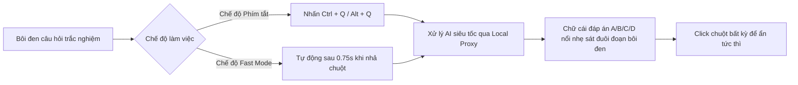

<div align="center">

# 👻 ViTai v3.0.0 — Vì Người Tài
### *Siêu trợ lý AI bôi đen cực nhanh — Ẩn mình tuyệt đối — Tối ưu cho Fedora (Wayland) & Windows*

[](https://github.com/namtacozz/ViTai/releases)
[](https://www.python.org/)
[](https://www.qt.io/)
[-51A2DA?style=for-the-badge&logo=fedora&logoColor=white)](https://getfedora.org/)
[](https://www.microsoft.com/)
[](LICENSE)

<br/>

[English](README.md) • [Tiếng Việt](#-tính-năng-đột-phá-v300) • [Tải về & Cài đặt](#-tải-về--cài-đặt-nhanh) • [Hướng dẫn](#-hướng-dẫn-sử-dụng) • [Tự Build](#-build-từ-mã-nguồn)

---

</div>

## 🌟 Giới thiệu

**ViTai** (tên cửa sổ: **"Vì Người Tài"**) là ứng dụng trợ lý AI ẩn mình (**Ghost Assistant**) đỉnh cao, được thiết kế chuyên biệt để hỗ trợ làm trắc nghiệm, giải đề thi, phân tích tài liệu siêu tốc ngay khi bạn vừa bôi đen văn bản trên màn hình.

Bước sang phiên bản **v3.0.0**, ViTai được tái cấu trúc toàn diện với triết lý **"Zero-Footprint" (Không để lại bất kỳ dấu vết nào)**:
* Không biểu tượng thanh tác vụ hay khay hệ thống (System Tray).
* Không xuất hiện trong trình chuyển cửa sổ **Alt + Tab** của hệ điều hành.
* Hiển thị duy nhất một **ký tự đáp án** nổi nhẹ nhàng ngay sát đuôi đoạn văn bản vừa bôi đen và biến mất ngay lập tức khi bạn bấm chuột.

---

## 🚀 Tính năng đột phá v3.0.0

| Tính năng | Mô tả chi tiết |
|---|---|
| 👻 **Pure Ghost Direct Overlay** | Lớp phủ trong suốt 100%, không viền, không khung nền. Chỉ hiển thị duy nhất 1 ký tự đáp án thanh thoát (`A`, `B`, `C`, `D`...) ngay sát đuôi phần văn bản bôi đen / vị trí con trỏ chuột. |
| 🖱️ **Kernel Mouse Tracking & Click-to-Dismiss** | Sử dụng driver cấp Linux Kernel (`evdev`) để bắt chính xác tọa độ nhả chuột khi vừa bôi đen xong. Bất kỳ thao tác click chuột nào trên màn hình cũng lập tức giải phóng và đóng overlay. |
| 🫥 **Zero System Tray & Zero Alt-Tab** | Hoạt động ngầm 100% trong nền hệ thống mà không tạo icon System Tray làm phiền. Hoàn toàn ẩn khỏi danh sách cửa sổ Alt-Tab của Window Manager. |
| ⌨️ **Phím tắt Menu Cài Đặt `Ctrl + Alt + V`** | Bật/tắt cửa sổ Cài đặt ("Vì Người Tài") bất kỳ lúc nào một cách bí mật thông qua phím tắt toàn cục. |
| ⚡ **Fast Mode (Zero-Hotkey)** | Tự động phân tích câu hỏi ngay khi người dùng vừa bôi đen và nhả chuột xong (debounce 0.75s). Không cần chạm tay vào bàn phím. |
| 🎨 **State-Aware UI & Unsaved Protection** | Giao diện cài đặt hiện đại 2 thẻ chính (**"Vỏ"** & **"Lõi"**), tích hợp huy hiệu trạng thái `● Chưa lưu` / `✓ Đã lưu` và hộp thoại cảnh báo chống mất dữ liệu khi đóng cửa sổ. |
| 🔐 **Nhật Ký Bảo Mật Admin** | Thẻ **Nhật Ký** hoạt động được ẩn mặc định. Mở khóa bí mật bằng cách nhấn 3 lần liên tiếp vào logo **ViTai** và nhập mật khẩu Admin (`vinguoitai / vit24052005`). |
| 🤖 **Local AI Proxy Gateway (Port 14555)** | Tích hợp sẵn máy chủ Gateway cục bộ, hỗ trợ OpenAI Codex Subscription (GPT-5.5 / GPT-5 mini), 9Router, Google Gemini và Kiro AI (AWS Builder ID). |
| 💾 **Bộ nhớ đệm Smart Answer Cache** | Lưu tạm kết quả các câu hỏi đã quét giúp phản hồi tức thì (**0ms**) khi gặp lại câu hỏi trùng khớp. |

---

## 📥 Tải về & Cài đặt nhanh

### Cách 1: Tải bản đóng gói sẵn (Releases)

Truy cập trang [Releases](https://github.com/namtacozz/ViTai/releases) và tải bản tương ứng với hệ điều hành:

* 🪟 **Windows**: Tải `ViTai-Windows-x64.zip` → Giải nén → Chạy `ViTai.exe`.
* 🐧 **Fedora 44 / Linux**: Tải `ViTai-v3.0.0-linux-fedora-x86_64.tar.gz` → Giải nén → Chạy `./ViTai`.

> 💡 **Khuyến nghị cho người dùng Fedora / Linux Wayland**:
> Để bật tính năng theo dõi vị trí chuột cấp Kernel (`evdev`), hãy thêm tài khoản vào nhóm `input`:
> ```bash
> sudo usermod -aG input $USER
> ```
> *(Sau đó Đăng xuất và Đăng nhập lại 1 lần để áp dụng quyền)*.

---

### Cách 2: Chạy trực tiếp từ mã nguồn

```bash
# 1. Clone mã nguồn
git clone https://github.com/namtacozz/ViTai.git
cd ViTai

# 2. Khởi chạy nhanh (Script tự tạo venv và cài đặt dependencies)
chmod +x run.sh
./run.sh --settings
```

---

## 🎮 Hướng dẫn sử dụng



1. **Lấy đáp án câu hỏi trắc nghiệm**:
   - Dùng chuột bôi đen toàn bộ câu hỏi và các phương án trả lời.
   - Nhấn **`Ctrl + Q`** (hoặc để tự động nếu đang bật **Fast Mode**).
   - Đáp án chữ cái (ví dụ: **`A`**) sẽ nổi nhẹ nhàng ngay sát đuôi câu hỏi.
   - Bấm chuột bất kỳ để tắt chữ đáp án.

2. **Mở Menu Cài đặt ("Vì Người Tài")**:
   - Nhấn tổ hợp phím **`Ctrl + Alt + V`**.
   - Thẻ **"Vỏ"**: Tùy chỉnh màu chữ, kích thước chữ đáp án (xem trước trực quan), bật/tắt Fast Mode, Cache.
   - Thẻ **"Lõi"**: Lựa chọn Provider AI (Codex, 9Router, Gemini, Kiro), Model, nhập API Key hoặc đăng nhập OAuth.

3. **Mở khóa thẻ "Nhật Ký" (Dành cho Quản Trị)**:
   - Trong cửa sổ Cài đặt, **nhấn nhanh 3 lần liên tiếp** vào logo **ViTai** ở góc trên bên trái thanh điều hướng.
   - Nhập tài khoản: `vinguoitai` / Mật khẩu: `vit24052005`.
   - Thẻ **Nhật Ký** sẽ hiện ra cho phép theo dõi toàn bộ luồng hoạt động, request AI và log hệ thống thời gian thực.

---

## 🔨 Build từ mã nguồn

### Trên Linux (Fedora 44 / Ubuntu)
```bash
chmod +x build_linux.sh
./build_linux.sh
# File kết quả nằm tại: dist/ViTai-v3.0.0-linux-fedora-x86_64.tar.gz
```

### Trên Windows
```cmd
python scripts\build_windows.py
:: File kết quả nằm tại: dist\ViTai\ViTai.exe
```

---

## 🏛️ Cấu trúc dự án

```text
ViTai/
├── assets/                  # Icons và tài nguyên đồ họa ứng dụng
├── src/vitai/
│   ├── capture.py           # Thu thập văn bản (Wayland PRIMARY & Win32 SendInput)
│   ├── overlay.py           # Ghost Overlay 100% trong suốt & Direct Bypass WM
│   ├── mouse_tracker.py     # Kernel Mouse Tracker (evdev) & Direct Click Listener
│   ├── selection_watcher.py # Daemon theo dõi bôi đen tự động cho Fast Mode
│   ├── gnome_shortcuts.py   # Quản lý phím tắt hệ thống GNOME gsettings
│   ├── ipc.py               # Unix Domain Socket IPC điều khiển kích hoạt nội bộ
│   ├── oauth_provider.py    # Luồng xác thực OAuth (Codex, Gemini, Kiro)
│   ├── token_store.py       # Quản lý và lưu trữ token an toàn
│   ├── auth_server.py       # Local server nhận callback OAuth
│   ├── model_registry.py    # Đồng bộ dynamic model từ các AI Provider
│   ├── proxy.py             # Local AI Proxy Gateway (port 14555)
│   ├── llm.py               # Kết nối và suy luận các mô hình AI
│   ├── settings.py          # Cửa sổ Cài đặt "Vì Người Tài" (State-Aware)
│   └── main.py              # Điều phối chính của toàn bộ ứng dụng
├── tests/                   # Bộ kiểm thử đơn vị tự động (Unit Tests)
├── run.sh                   # Script khởi chạy môi trường Linux
├── build_linux.sh           # Script đóng gói binary Linux
└── requirements.txt         # Thư viện phụ thuộc
```

---

## 📄 Bản quyền (License)

Dự án được phân phối dưới giấy phép **MIT License**. Xem file [LICENSE](LICENSE) để biết thêm chi tiết.

---

<div align="center">
  <b>ViTai v3.0.0 — Vì Người Tài: Tốc độ, Ẩn mình & Đẳng cấp.</b>
</div>
