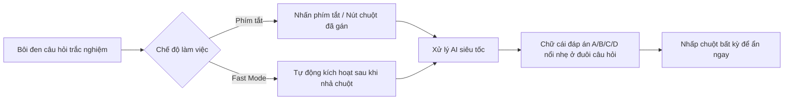

<div align="center">

# 👻 ViTai v3.0.1 — Vì Người Tài
### *Siêu trợ lý AI bôi đen cực nhanh — Ẩn mình tuyệt đối — Tối ưu cho macOS, Linux (Fedora/Ubuntu Wayland & X11) & Windows*

[](https://github.com/namtacozz/ViTai/releases)
[](https://www.python.org/)
[](https://www.qt.io/)
[](https://apple.com)
[](https://getfedora.org/)
[](https://www.microsoft.com/)
[](LICENSE)

<br/>

[Tính năng v3.0.1](#-tính-năng-đột-phá-v301) • [Tải về & Cài đặt](#-tải-về--cài-đặt-nhanh) • [Hướng dẫn sử dụng](#-hướng-dẫn-sử-dụng) • [Quản trị & Đăng ký VietQR](#-quản-trị--kích-hoạt-tự-động-vietqr) • [Tự Build](#-build-từ-mã-nguồn)

---

</div>

## 🌟 Giới thiệu

**ViTai** (tên ứng dụng: **"Vì Người Tài"**) là siêu trợ lý AI ẩn mình (**Ghost Assistant**) đỉnh cao, được thiết kế chuyên biệt để giải đề thi, câu hỏi trắc nghiệm, và phân tích tài liệu siêu tốc ngay khi bạn vừa bôi đen văn bản trên màn hình.

Phiên bản **v3.0.1** mang đến trải nghiệm hoàn hảo với triết lý **"Zero-Footprint" (Không để lại dấu vết)**:
* **Không icon Taskbar/System Tray**: Ứng dụng chạy ngầm tuyệt đối, không làm phiền màn hình làm việc.
* **Không xuất hiện trong Alt + Tab / Cmd + Tab**: Hoàn toàn vô hình trước trình quản lý cửa sổ hệ điều hành.
* **Ghost Direct Overlay**: Chỉ hiển thị duy nhất **1 ký tự đáp án** nổi nhẹ nhàng ngay sát đuôi đoạn văn bản vừa bôi đen và biến mất ngay khi nhấp chuột.
* **Tự động kích hoạt tài khoản 24/7**: Tích hợp cổng thanh toán VietQR ngân hàng (SePay API) cho phép người dùng tự quét mã chuyển khoản 50.000đ và kích hoạt tài khoản ngay tức thì.

---

## 🚀 Tính năng đột phá v3.0.1

| Tính năng | Mô tả chi tiết |
|---|---|
| 👻 **Pure Ghost Direct Overlay** | Lớp phủ trong suốt 100%, không viền, không khung nền. Ký tự đáp án (`A`, `B`, `C`, `D`...) xuất hiện ngay sát cạnh phải ký tự cuối cùng của đoạn văn bản bôi đen. |
| 🎯 **Căn Tọa Độ Đuôi Bôi Đen** | Tự động nhận diện tọa độ kết thúc của thao tác bôi đen (kéo chuột hoặc click đúp) trên cả **Windows, Linux (Wayland/X11), macOS**. |
| 💳 **Kích Hoạt Tự Động VietQR 50.000đ** | Tích hợp cổng thanh toán SePay quét mã VietQR ngân hàng **MBBank (`99924052005 - LE VO THANH NAM`)**, tự động xác nhận và mở khóa tài khoản ngay lập tức. |
| 🛡️ **Bảo Mật Phần Cứng & Hybrid Cloud Auth** | Khóa cố định địa chỉ MAC ở lần đăng nhập đầu tiên cho User thường. Tài khoản Admin gốc `vinguoitai` đăng nhập tự do mọi máy tính. Đồng bộ đa máy qua Supabase / Firebase. |
| 👨‍💼 **Menu Quản Trị Người Dùng Toàn Diện** | Tab Quản Trị hiển thị danh sách người dùng, mật khẩu, vai trò, địa chỉ MAC, cho phép Thêm User, Reset MAC, Đổi Mật Khẩu, Khóa/Mở và Xóa User trực quan. |
| 🎨 **Bảng Màu Tròn 360° & Xem Trước Đa Nền** | Bảng chọn màu nghệ thuật Photoshop/Aseprite style; khung xem trước hỗ trợ chuyển đổi linh hoạt giữa **Nền Đen** và **Nền Trắng** để kiểm tra độ tương phản. |
| 💾 **Lưu Bền Vững Cấu Hình & Model AI** | Lưu giữ Model AI (`config.model`), Provider, Hotkey, Theme (Sáng/Tối) và màu sắc đã chọn giữa mọi lần khởi động app. |
| ⚡ **Multi-Desktop Fallback Fast Mode** | Tự động phân tích câu hỏi ngay khi nhả chuột bôi đen (debounce 0.75s) trên Wayland (`wl-paste`), X11 (`xclip`/`xsel`) và macOS/Windows. |
| 🤖 **Đa Dạng AI Provider** | Hỗ trợ OpenAI Codex (ChatGPT Plus/Pro), Google Gemini, Kiro AI, 9Router Local Proxy (:20128), OpenRouter, Groq và DeepSeek. |
| ⚡ **Bộ Nhớ Đệm Smart Answer Cache** | Lưu tạm đáp án các câu hỏi đã hỏi giúp phản hồi tức thì (**0ms**) khi gặp lại câu trùng lặp. |

---

## 📥 Tải về & Cài đặt nhanh

### Tải bản đóng gói sẵn (Releases)

Truy cập trang [Releases](https://github.com/namtacozz/ViTai/releases) và tải bản tương ứng:

* 🪟 **Windows (10 / 11)**: Tải `ViTai-Windows-x64.zip` $\rightarrow$ Giải nén $\rightarrow$ Chạy `ViTai.exe`.
* 🐧 **Linux (Fedora / Ubuntu / Arch)**: Tải `ViTai-Linux-x86_64.tar.gz` $\rightarrow$ Giải nén $\rightarrow$ Chạy `./ViTai`.
* 🍎 **macOS (Apple Silicon & Intel)**: Tải `ViTai-MacOS.tar.gz` $\rightarrow$ Mở `ViTai.app` hoặc chạy `./ViTai`.

> 💡 **Khuyến nghị cho Linux Wayland / Fedora**:
> Thêm quyền đọc thiết bị chuột cấp Kernel cho user hiện tại:
> ```bash
> sudo usermod -aG input $USER
> ```
> *(Sau đó Đăng xuất và Đăng nhập lại 1 lần)*

> 💡 **Khuyến nghị cho macOS**:
> Cấp quyền **Accessibility (Trợ năng)** và **Input Monitoring (Theo dõi đầu vào)** trong *System Settings $\rightarrow$ Privacy & Security* để app nhận phím tắt toàn cục.

---

## 🎮 Hướng dẫn sử dụng



1. **Lấy đáp án trắc nghiệm**:
   - Dùng chuột bôi đen câu hỏi và các lựa chọn trả lời.
   - Nhấn phím tắt kích hoạt (mặc định: `Alt + Q` hoặc nút chuột tùy chọn).
   - Đáp án (ví dụ: `A`) sẽ hiện ngay sát đuôi phần bôi đen.
   - Nhấp chuột bất kỳ trên màn hình để ẩn đáp án ngay lập tức.

2. **Mở Menu Cài Đặt ("Vì Người Tài")**:
   - Nhấn tổ hợp phím **`Ctrl + Alt + V`** (hoặc **`Cmd + Alt + V`** trên macOS).
   - **Thẻ Vỏ**: Đổi phím tắt/nút chuột, chọn màu chữ bằng Bảng màu tròn 360°, đổi kích thước chữ, xem trước trên nền Đen/Trắng, bật Fast Mode, Cache.
   - **Thẻ Lõi**: Lựa chọn Provider AI (Codex, Gemini, Kiro, 9Router, DeepSeek...), chọn Model AI, cấu hình API Key hoặc OAuth.
   - **Thẻ Quản Trị**: Quản lý tài khoản, xem mật khẩu, reset địa chỉ MAC khi đổi máy tính, cấu hình Cloud Sync Supabase/Firebase.

---

## 💳 Quản Trị & Kích Hoạt Tự Động VietQR

1. **Đăng ký tài khoản tự động (Quét QR 50.000đ)**:
   - Người dùng mới mở app $\rightarrow$ Nhấn nút **`Đăng Ký Tài Khoản (Quét QR 50.000đ)`** tại màn hình khóa.
   - Quét mã VietQR chuyển khoản chính xác 50.000đ tới **MBBank (`99924052005 - LE VO THANH NAM`)** với nội dung `VITAIxxxxxx`.
   - Cổng SePay tự động ghi nhận tiền vào và mở khóa tài khoản tức thì mà không cần duyệt thủ công.

2. **Tài khoản Quản Trị Viên (Admin)**:
   - Tài khoản Admin gốc: `vinguoitai` (Mật khẩu mặc định: `vit24052005`).
   - Admin có quyền truy cập toàn bộ menu Quản Trị, cấp phát user mới, đổi mật khẩu và reset MAC cho học viên.

---

## 🔨 Build từ mã nguồn

### Yêu cầu môi trường
- Python 3.10 trở lên
- `pip install -r requirements.txt`

### Build trên Linux
```bash
chmod +x build_linux.sh
./build_linux.sh
# File kết quả: dist/ViTai/ViTai và dist/ViTai-v3.0.1-linux-x86_64.tar.gz
```

### Build trên Windows
```cmd
python scripts\build_windows.py
:: File kết quả: dist\ViTai\ViTai.exe và dist\ViTai-Windows-x64.zip
```

### Build trên macOS
```bash
chmod +x build_mac.sh
./build_mac.sh
# File kết quả: dist/ViTai.app và dist/ViTai-MacOS.tar.gz
```

---

## 🧪 Kiểm thử tự động (Unit Tests)

Dự án đi kèm bộ kiểm thử toàn diện với **50+ test cases**:

```bash
pytest -v
```

---

## 📄 Bản quyền (License)

Phát hành theo giấy phép [MIT License](LICENSE).
Tác giả: **Vì Người Tài (ViTai Team)**.
